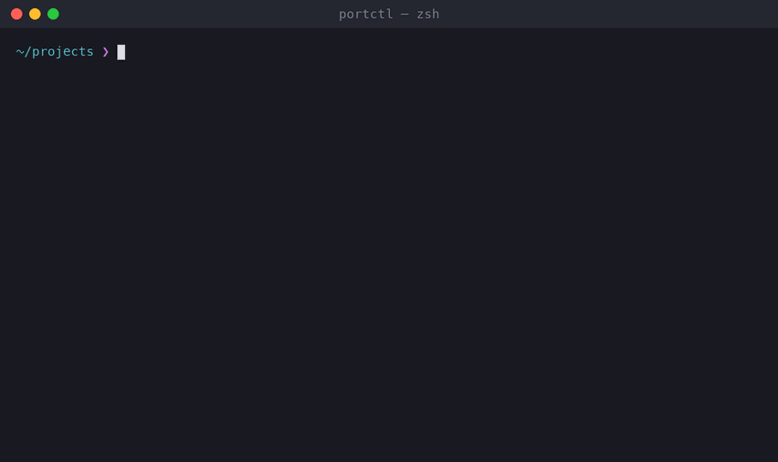

# portctl



`portctl` is a small command-line tool for Linux and macOS that does two things:

- **SSH tunnels.** It opens a port on your computer that leads to a port on a remote server, like `ssh -L`, but you name your tunnels once in a config file and start and stop them with one short command.
- **Local ports.** It shows which program is using a port on your computer, and can stop it safely.

```text
$ portctl tunnel start 8000
✓ Tunnel started

  127.0.0.1:8000 → 127.0.0.1:8000
  via davide@production
  PID 41230

$ portctl port info 5432
● Port 5432

  Process: postgres (PID 3904, user davide)
  Listen:  [::1], 127.0.0.1
  Command: /opt/homebrew/opt/postgresql@14/bin/postgres -D /opt/homebrew/var/postgresql@14
  Started: Wed Sep 23 09:49:27 2026
```

It uses the `ssh` already installed on your computer, so your keys, passwords, `~/.ssh/config` and ssh-agent keep working as usual.

## Contents

1. [Install](#install)
2. [Requirements](#requirements)
3. [Build from source](#build-from-source)
4. [Tab completion](#tab-completion)
5. [First steps](#first-steps)
6. [Configuration](#configuration)
7. [Commands](#commands)
8. [Troubleshooting](#troubleshooting)
9. [Development](#development)

## Install

**macOS**, with [Homebrew](https://brew.sh):

```bash
brew install oldanidavide/tap/portctl
```

With the full name, Homebrew adds the `oldanidavide/tap` tap and trusts it for portctl by itself.

**Linux** (Debian, Ubuntu, Fedora, openSUSE, Arch, CachyOS and others):

```bash
curl -fsSL https://raw.githubusercontent.com/oldanidavide/portctl/main/install.sh | sh
```

The script downloads the latest release for your processor (x86_64 or arm64), checks it against the published checksums, and installs it with your package manager: a `.deb` with apt, an `.rpm` with dnf, yum or zypper, a `.pkg.tar.zst` with pacman. It asks for your password through `sudo`. On other systems it copies the program to `/usr/local/bin`.

Options, written after the `|`:

```bash
curl -fsSL https://raw.githubusercontent.com/oldanidavide/portctl/main/install.sh | PORTCTL_VERSION=0.1.0 sh    # a specific version
curl -fsSL https://raw.githubusercontent.com/oldanidavide/portctl/main/install.sh | PORTCTL_METHOD=binary sh   # only copy the program
```

You can also download a package from the [Releases page](https://github.com/oldanidavide/portctl/releases/latest) and install it yourself, for example `sudo apt install ./portctl_0.1.0_linux_amd64.deb`.

**With Go** (1.23 or later):

```bash
go install github.com/oldanidavide/portctl/cmd/portctl@latest
```

Then check it works with `portctl version`.

With the install script on Linux, [tab completion](#tab-completion) already works: just open a new terminal. With Homebrew it works right away in fish; in zsh and bash see [Tab completion](#tab-completion). With `go install` or `PORTCTL_METHOD=binary`, enable it once as described there.

**Update:** on macOS, `brew upgrade portctl`. On Linux, run the install script again.

**Uninstall:** on macOS, `brew uninstall portctl`. On Linux, with your package manager: `sudo apt remove portctl`, `sudo dnf remove portctl`, `sudo pacman -R portctl`. If the script only copied the program: `sudo rm /usr/local/bin/portctl`.

## Requirements

- Linux / macOS
- `ssh` (preinstalled on macOS and on nearly every Linux distribution)
- `lsof` for the `port` commands (preinstalled on macOS; on Linux, `ss` also works)
- [Go](https://go.dev/dl/) 1.23 or later, only to build it from source

## Build from source

Skip this section if you installed portctl with one of the methods in [Install](#install).

**1. Build.** From the project folder:

```bash
go build -o portctl ./cmd/portctl
```

This creates the `portctl` program in the current folder. You can try it with `./portctl help`.

To show a version number in `portctl version`, build with:

```bash
go build -ldflags "-X github.com/oldanidavide/portctl/internal/cli.version=0.1.0" -o portctl ./cmd/portctl
```

**2. Install it as a command**, so you can type `portctl` from any folder. Choose one:

For all users (asks for your password):

```bash
sudo install -m 0755 portctl /usr/local/bin/portctl
```

Only for you, without `sudo`:

```bash
mkdir -p ~/.local/bin
install -m 0755 portctl ~/.local/bin/portctl
```

If you use `~/.local/bin`, it has to be on your `PATH`. Most Linux distributions already include it. On macOS, add this line to `~/.zshrc`, then open a new terminal:

```bash
export PATH="$HOME/.local/bin:$PATH"
```

**3. Check it works:**

```bash
portctl version
```

To update, build again and repeat step 2.

## Tab completion

With completion on, pressing <kbd>Tab</kbd> completes commands, options and even your tunnel and port numbers:

```text
$ portctl p<Tab>                →  portctl port
$ portctl tunnel st<Tab>        →  start  start-all  stop  stop-all
$ portctl tunnel start <Tab>
3306  -- mysql → root@database-server:3306
8000  -- development → davide@production:8000
$ portctl port kill <Tab>       →  the ports in use, with their program
```

Zsh and fish also show the description next to each value.

If you installed portctl with the install script on Linux, completion is already set up: open a new terminal and try it. With Homebrew, fish needs nothing, and zsh needs nothing only if your `~/.zshrc` already turns on completion (Oh My Zsh and similar do; plain macOS zsh does not). Otherwise, and with `go install` or a build from source, enable it once per shell as shown below. Not sure which shell you use? Run `echo $SHELL`. On macOS it is zsh unless you changed it.

### Zsh (default on macOS)

Add one line to `~/.zshrc`:

```bash
echo 'source <(portctl completion zsh)' >> ~/.zshrc
```

Then open a new terminal.

### Bash

On Linux:

```bash
echo 'eval "$(portctl completion bash)"' >> ~/.bashrc
```

On macOS, the Terminal app reads `~/.bash_profile` instead:

```bash
echo 'eval "$(portctl completion bash)"' >> ~/.bash_profile
```

Then open a new terminal.

### Fish

```bash
mkdir -p ~/.config/fish/completions
portctl completion fish > ~/.config/fish/completions/portctl.fish
```

Then open a new terminal.

After you update portctl, nothing needs to be redone: completion always asks the installed `portctl` what to suggest.

### Check that it works

Type `portctl ` (with the space), then press <kbd>Tab</kbd>. You should see `tunnel`, `port`, `config` and the other commands. If you see the names of files instead, see [Troubleshooting](#troubleshooting).

## First steps

**1. Create the configuration file:**

```bash
portctl config init
```

This writes an example to `~/.config/portctl/config.yaml`. `portctl config path` prints its location.

**2. Open it and set your server** (see [Configuration](#configuration)):

```yaml
ssh:
  user: davide
  host: your-host-ip

tunnels:
  - port: 8000
    name: development
```

**3. Start the tunnel:**

```bash
portctl tunnel start 8000
```

If the server asks for a password or a key passphrase, type it as you would with `ssh`. Then the tunnel keeps running in the background, and `http://localhost:8000` on your computer reaches port 8000 on the server.

**4. See it and stop it:**

```bash
portctl tunnel list
portctl tunnel stop 8000
```

## Configuration

The file is `~/.config/portctl/config.yaml`. A complete example:

```yaml
# The server used by every tunnel, unless a tunnel says otherwise.
ssh:
  user: davide                          # SSH user name
  host: your-host-ip                      # server name or IP; an alias from ~/.ssh/config works too
  port: 22                              # SSH port (optional, default 22)
  identity_file: ~/.ssh/id_ed25519      # private key (optional)
  keepalive:                            # keep idle connections open (optional)
    enabled: true
    interval: 30                        # seconds between checks
    count_max: 3                        # failed checks before giving up

defaults:
  remote_host: 127.0.0.1                # where the port lives, as seen from the server

tunnels:
  - port: 8000                          # port on your computer
    name: development                   # a label you choose
    auto_start: true                    # started by "portctl tunnel start-all"

  - port: 3306
    name: mysql
    remote_port: 3307                   # port on the server, if different
    user: root                          # these override the ssh: section
    host: database-server
```

What each tunnel setting means:

| Setting | Meaning | If missing |
|---|---|---|
| `port` | Port on your computer | required |
| `remote_port` | Port on the server | same as `port` |
| `name` | Label shown in lists and completion | none |
| `auto_start` | Include in `tunnel start-all` | `false` |
| `user`, `host`, `identity_file` | Use a different server or key for this tunnel | taken from `ssh:` |
| `remote_host` | Reach another machine through the server, e.g. a database host | taken from `defaults:` |

Format rules: indent with two spaces, and use `#` for comments.

Passwords cannot be stored in the file. `ssh` asks for them when needed. For more SSH settings (jump hosts, other keys, and so on), use `~/.ssh/config` as usual: `portctl` follows it.

## Commands

### Tunnels

| Command | What it does |
|---|---|
| `portctl tunnel list` | Show configured tunnels and whether they are running (`--json` for scripts) |
| `portctl tunnel start <port>` | Start a tunnel in the background |
| `portctl tunnel stop <port>` | Stop a tunnel |
| `portctl tunnel restart <port>` | Stop and start again |
| `portctl tunnel start-all` | Start every tunnel with `auto_start: true` |
| `portctl tunnel stop-all` | Stop every running tunnel |
| `portctl tunnel restart-all` | Restart every running tunnel |
| `portctl tunnel show <port>` | Show a tunnel's settings and the exact `ssh` command |
| `portctl tunnel logs <port>` | Show what `ssh` printed, useful when a tunnel stops |

Options for `tunnel start`:

| Option | What it does |
|---|---|
| `-u`, `--user <name>` | Use another SSH user |
| `-H`, `--host <server>` | Use another server |
| `--identity <file>` | Use another private key |
| `--dry-run` | Only print the `ssh` command, do not run it |
| `--foreground` | Keep `ssh` in the terminal, to see what goes wrong; stop with <kbd>Ctrl</kbd>+<kbd>C</kbd> |

Examples:

```bash
portctl tunnel start 8000                      # as configured
portctl tunnel start 8000 --dry-run            # see what would run
portctl tunnel start 9000 -u davide -H myvps   # a tunnel that is not in the config
```

With `-u` and `-H` you can start a tunnel without any config file. `restart` remembers the options a tunnel was started with.

If the port on your computer is already taken, `tunnel start` tells you which program holds it and how to stop it.

### Ports

| Command | What it does |
|---|---|
| `portctl port list` | Show every port in use, with the program, PID and user (`--json` for scripts) |
| `portctl port info <port>` | Show the program using a port, with its full command and start time |
| `portctl port kill <port>` | Stop the program using a port, after asking for confirmation |

Options for `port kill`:

| Option | What it does |
|---|---|
| `-y`, `--yes` | Do not ask for confirmation |
| `-f`, `--force` | Force-stop the program if it does not stop by itself |

`port kill` is careful: it stops portctl's own tunnels the clean way, refuses to touch system processes and other users' programs, and checks right before stopping that the program still holds the port.

Without `sudo`, you only see your own programs. Use `sudo portctl port list` to see all of them.

### Other

| Command | What it does |
|---|---|
| `portctl config` | Show where the configuration file is |
| `portctl config init` | Create an example configuration |
| `portctl completion zsh\|bash\|fish` | Print the completion script (see [Tab completion](#tab-completion)) |
| `portctl version` | Show the version |
| `portctl help` | Show all commands |

### Options for every command

| Option | What it does |
|---|---|
| `-q`, `--quiet` | Do not print success messages |
| `--no-color` | Turn off colors (also `NO_COLOR=1`) |

## Troubleshooting

**Tab completes file names instead of commands.** Completion is not enabled in this shell. Follow [Tab completion](#tab-completion) for your shell (`echo $SHELL` tells you which), then open a new terminal.

**`command not found: portctl`.** The folder where you installed it is not on your `PATH`. See step 2 of [Build from source](#build-from-source). With `go install`, add `$(go env GOPATH)/bin` (usually `~/go/bin`) to your `PATH`.

**The tunnel starts but then stops working.** Run `portctl tunnel logs <port>` to see the `ssh` error, or `portctl tunnel start <port> --foreground` to watch it live.

**"port already in use".** Another program holds that port on your computer. `portctl port info <port>` shows which, and `portctl port kill <port>` stops it.

## Development

```bash
go test ./...
go build ./...
```

The project uses only the Go standard library.

### Releasing

Releases are built by [GoReleaser](https://goreleaser.com) (`.goreleaser.yaml`) in the `release` GitHub Action. To publish a version:

```bash
git tag v0.1.0
git push --tags
```

The Action runs the tests, then publishes the archives, the `.deb`, `.rpm` and Arch (`.pkg.tar.zst`) packages and the checksums on the Releases page, and updates the Homebrew tap, all with the completion scripts included. `install.sh` always downloads from the latest release, so it needs no changes.

To try it locally without publishing anything: `goreleaser release --snapshot --clean` (the output goes to `dist/`).

One-time setup, for Homebrew: create an empty public repository `oldanidavide/homebrew-tap`. Create a fine-grained GitHub token with *Contents: read and write* on that repository only, and save it in this repository as the Actions secret `HOMEBREW_TAP_TOKEN`. Until the secret exists, the release still works and only the Homebrew step is skipped.

Known limitations:

- Only local forwarding (`ssh -L`) is supported for now. Remote (`-R`) and SOCKS (`-D`) tunnels are not.
- `ssh` reports login errors before going to the background, but the connection can still drop later. Check `portctl tunnel logs <port>`.
